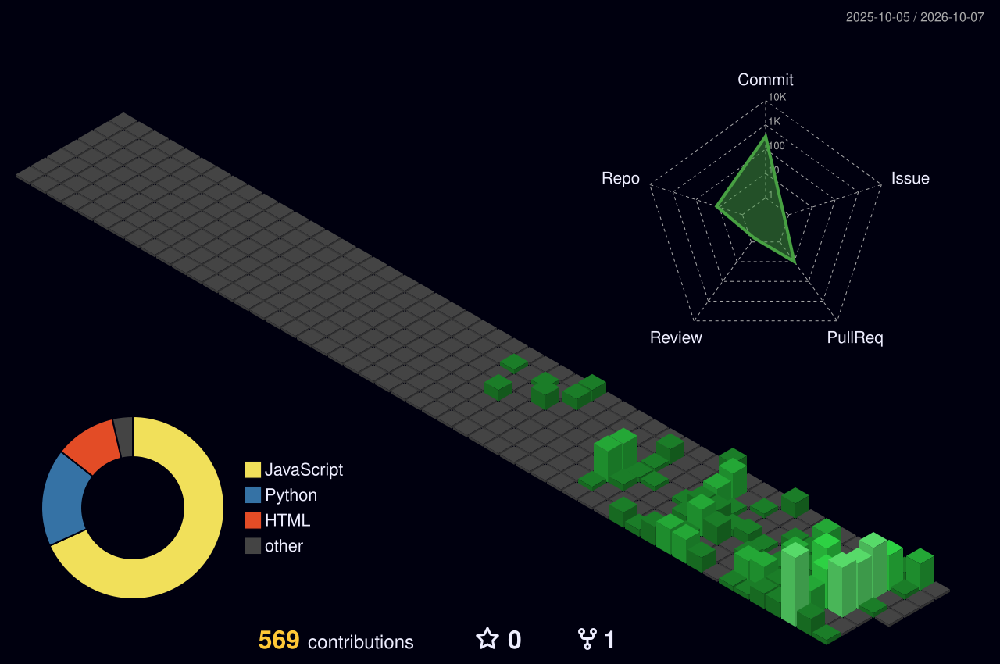

<picture>
  <source media="(prefers-color-scheme: dark)" srcset="https://readme-typing-svg.demolab.com?font=Fira+Code&size=24&pause=1200&color=2DD4BF&background=00000000&center=true&vCenter=true&width=650&lines=Hey%2C+I'm+Oluwadarasimi.;I+ask+%22what+if+this+breaks%3F%22+for+a+living.;From+software+QA+to+security+assurance.;HNG14+QA+Finalist+%E2%80%94+8+stages%2C+3+fails%2C+still+here." />
  <source media="(prefers-color-scheme: light)" srcset="https://readme-typing-svg.demolab.com?font=Fira+Code&size=24&pause=1200&color=0D9488&background=FFFFFF00&center=true&vCenter=true&width=650&lines=Hey%2C+I'm+Oluwadarasimi.;I+ask+%22what+if+this+breaks%3F%22+for+a+living.;From+software+QA+to+security+assurance.;HNG14+QA+Finalist+%E2%80%94+8+stages%2C+3+fails%2C+still+here." />
  
</picture>

 

I am quiet by nature. I watch more than I talk. That works well in testing, because I notice things, especially the cracks no one else sees, and I want to know why they are there.

I came to security through quality assurance. QA taught me to ask "what if this breaks?" My M.Sc. research taught me to ask "what if someone breaks it on purpose?" My thesis built an explainable AI framework for phishing URL detection, and since then my work has sat where testing meets security: proving that systems are secure, fair and reliable, not just assuming it.

I am an M.Sc. Computer Science student and graduate assistant at Lead City University, and a QA engineer on real products.

 

<table align="center">
<tr>
<td valign="top" width="50%">

### 🧰 what I work with

</td>
<td valign="top" width="50%">

### 📌 right now

- 🎓 Finishing my M.Sc. Computer Science (December 2026), with a thesis on explainable AI for phishing URL detection
- 🛡️ Growing into security assurance: API security testing, OWASP-driven checks, and verifying that systems behave as intended
- 🧬 Building a fairness-testing framework for AI recruitment systems (bias checks as automated test assertions in CI/CD), headed toward a journal paper
- 🧪 QA engineer on Vettika AI Recruiter and a healthcare booking platform: API test suites, functional and accessibility testing, bug tracking
- 💬 Ask me about API testing, phishing detection, fairness testing, or that one time Git Bash ruined my presentation

</td>
</tr>
</table>

 

### 🔍 featured work

| Project | What it does |
|---|---|
| [bias-recruitment-testing](https://github.com/LovableLynx/bias-recruitment-testing) | Treats fairness checks as automated test assertions in a CI pipeline for AI recruitment models |
| [regression-diff-triage-agent](https://github.com/LovableLynx/regression-diff-triage-agent) | CLI tool that diagnoses why API regression tests broke, classifying failures by root cause: schema change, auth, endpoint down, rate limiting, flaky or logic bug |
| [opportunity-radar](https://github.com/LovableLynx/opportunity-radar) | 🏆 4th place, She Code Africa × Apify BuildHER Hackathon. Matches African students to real scholarship and admission opportunities, and checks each listing for scam red flags using evidence |
| [zedu-api-automation](https://github.com/LovableLynx/zedu-api-automation) | Automated backend API test suite in Python and Pytest |
| [kaneloop-ai](https://github.com/LovableLynx/kaneloop-ai) | Describe a feature, generate it, and have a real browser verify it, with failures auto-healed |

 

### 🏙️ 3D contribution skyline

 

### 📊 activity

<picture>
  <source media="(prefers-color-scheme: dark)" srcset="https://github-readme-stats.vercel.app/api?username=LovableLynx&show_icons=true&theme=dracula&hide_border=true&bg_color=00000000" />
  <source media="(prefers-color-scheme: light)" srcset="https://github-readme-stats.vercel.app/api?username=LovableLynx&show_icons=true&theme=default&hide_border=true&bg_color=00000000" />
  
</picture>
<picture>
  <source media="(prefers-color-scheme: dark)" srcset="https://github-readme-streak-stats.herokuapp.com/?user=LovableLynx&theme=dracula&hide_border=true&background=00000000" />
  <source media="(prefers-color-scheme: light)" srcset="https://github-readme-streak-stats.herokuapp.com/?user=LovableLynx&theme=default&hide_border=true&background=00000000" />
  
</picture>

 

<picture>
  <source media="(prefers-color-scheme: dark)" srcset="https://github-readme-activity-graph.vercel.app/graph?username=LovableLynx&theme=react-dark&hide_border=true&bg_color=00000000" />
  <source media="(prefers-color-scheme: light)" srcset="https://github-readme-activity-graph.vercel.app/graph?username=LovableLynx&theme=minimal&hide_border=true&bg_color=00000000" />
  
</picture>

 

thanks for stopping by 👋

